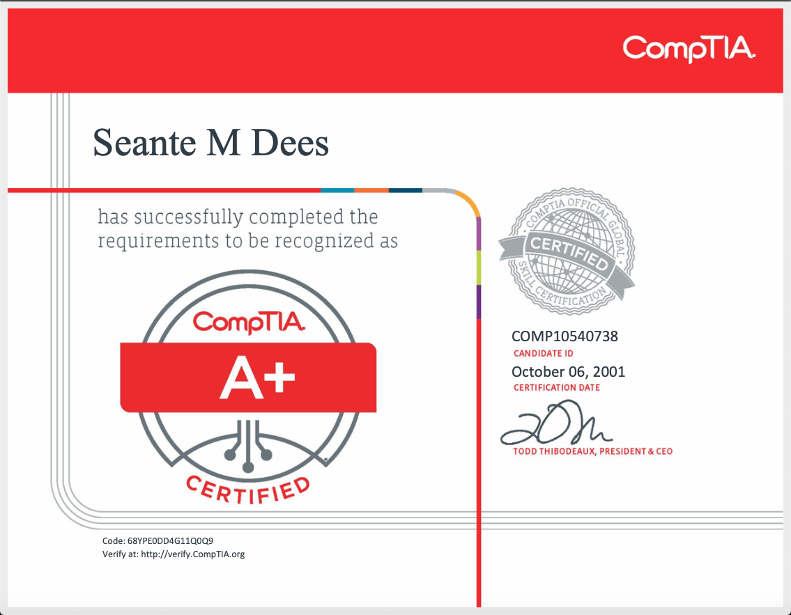

---

title: "Hello Friend"
message: "bp1.0_hellofriend.sh"
date: "08/22/2020"
description: "Hello Friend. This blog will detail the steps I'm taking to learn about the exciting field of cybersecurity."

---

***

A little about me...

Way back in 2001, I stumbled across a local government funded organization that offered free classes in a number of different fields with the only criteria being that you had to be a resident of the city of Detroit, MI and between the ages of 18 and 24. I was specifically drawn to the two technology classes they offered which were PC repair and web development. I remember one of the career counselors mentioned how difficult it would be to get a position as a web developer (some things never change) as the industry was still trying to recover from the Dot-com bubble bursting, but that I should learn about buying domains and selling them to larger companies as a way to make easy money. Ultimately, I choose to learn PC repair and spent every moment of every hour learning everything I could.

After completing the program, I took and passed the CompTIA A+ exam after a few months of study. Back then, the certifications were good for life, so you never had to worry about them expiring. 



After not having any luck securing a PC repair position, my mom introduced me to the guys in the IT department at her employer and they encouraged me to attain the CompTIA Network+ certification to increases my chances of getting hired. While studying for the exam, I was able to attain a entry-level help desk position and soon realized that I was not cut out for that line of work. I wanted to be hands-on with the box, not guiding customers through their problems.
Not long after that, I got a job in a factory and abandoned the Network+ certification any dreams of landing another position in IT. 


Fast forward to 2016 where I grew unhappy and unfullfilled with my career and the work I was doing. I wanted more out of life than working a position that left me mentally and physically drained. I decided I would try to land a job as a web developer and began using online resources to teach myself how to code. I bought a MacBook, purchased a subscription to Treehouse and spent every evening learning as much as a could. Forunately for me, the company I worked for at the time decided to layoff 50 percent of their workforce and I was able to devote all my time improving as a developer.

As a side business, I began programming and selling Android Boxes and thought I'd be able to reach a bigger audience by building a website. [Windsor Android Boxes](https://sdees82.github.io/WindsorAndroidBox/#contact "Windsor Android Boxes") was the first site I ever built and it was such a big accomplishment for me at the time (although It's pretty terrible). I proved to myself that this was something I could actually do on a professional level. A short time after building that site I was able to land a full-time developer job and have been working for them for almost 4 years now.

I've been pretty successful as a developer and I've been able to work on really exciting projects. My biggest accomplishment by far was working on the E-commerce store for the 2019 NBA Champion Toronto Raptors. I was also able to work on projects for the Pittsburg Penguins, La Sparks, Seattle Storm, Winnipeg Blue Bombers, Toronto FC and many more professional sports organizations.

As rewarding as web development is, I'm now looking to gain even more skills and one area that I've really been drawn to the last couple of years is cybersecurity. My goal for the next few months is to study and gain a few certifications, specifically the Network+ and Security+ . I plan to have both ceritifcations under my belt by the end of the year. I'll be using this blog as a way to document my journey as I explore this very exciting field. 
<!-- ## Typographic replacements

Enable typographer option to see result.

(c) (C) (r) (R) (tm) (TM) (p) (P) +-

test.. test... test..... test?..... test!....

!!!!!! ???? ,,  -- ---

"Smartypants, double quotes" and 'single quotes'


## Emphasis

**This is bold text**

__This is bold text__

*This is italic text*

_This is italic text_

~~Strikethrough~~


## Blockquotes


> Blockquotes can also be nested...
>> ...by using additional greater-than signs right next to each other...
> > > ...or with spaces between arrows.


## Lists

Unordered

+ Create a list by starting a line with `+`, `-`, or `*`
+ Sub-lists are made by indenting 2 spaces:
  - Marker character change forces new list start:
    * Ac tristique libero volutpat at
    + Facilisis in pretium nisl aliquet
    - Nulla volutpat aliquam velit
+ Very easy!

Ordered

1. Lorem ipsum dolor sit amet
2. Consectetur adipiscing elit
3. Integer molestie lorem at massa


1. You can use sequential numbers...
1. ...or keep all the numbers as `1.`

Start numbering with offset:

57. foo
1. bar


## Code

Inline `code`

Indented code

    // Some comments
    line 1 of code
    line 2 of code
    line 3 of code


Block code "fences"

```
Sample text here...
```

Syntax highlighting

``` js
var foo = function (bar) {
  return bar++;
};

console.log(foo(5));
```

## Tables

| Option | Description |
| ------ | ----------- |
| data   | path to data files to supply the data that will be passed into templates. |
| engine | engine to be used for processing templates. Handlebars is the default. |
| ext    | extension to be used for dest files. |

Right aligned columns

| Option | Description |
| ------:| -----------:|
| data   | path to data files to supply the data that will be passed into templates. |
| engine | engine to be used for processing templates. Handlebars is the default. |
| ext    | extension to be used for dest files. |


## Links

[link text](http://dev.nodeca.com)

[link with title](http://nodeca.github.io/pica/demo/ "title text!")

Autoconverted link https://github.com/nodeca/pica (enable linkify to see)


## Images


Like links, Images also have a footnote style syntax

![Alt text][id]

With a reference later in the document defining the URL location:

[id]: https://octodex.github.com/images/dojocat.jpg  "The Dojocat"


## Plugins

The killer feature of `markdown-it` is very effective support of
[syntax plugins](https://www.npmjs.org/browse/keyword/markdown-it-plugin).


### [Emojies](https://github.com/markdown-it/markdown-it-emoji)

> Classic markup: :wink: :crush: :cry: :tear: :laughing: :yum:
>
> Shortcuts (emoticons): :-) :-( 8-) ;)

see [how to change output](https://github.com/markdown-it/markdown-it-emoji#change-output) with twemoji.


### [Subscript](https://github.com/markdown-it/markdown-it-sub) / [Superscript](https://github.com/markdown-it/markdown-it-sup)

- 19^th^
- H~2~O


### [\<ins>](https://github.com/markdown-it/markdown-it-ins)

++Inserted text++


### [\<mark>](https://github.com/markdown-it/markdown-it-mark)

==Marked text==


### [Footnotes](https://github.com/markdown-it/markdown-it-footnote)

Footnote 1 link[^first].

Footnote 2 link[^second].

Inline footnote^[Text of inline footnote] definition.

Duplicated footnote reference[^second].

[^first]: Footnote **can have markup**

    and multiple paragraphs.

[^second]: Footnote text.


### [Definition lists](https://github.com/markdown-it/markdown-it-deflist)

Term 1

:   Definition 1
with lazy continuation.

Term 2 with *inline markup*

:   Definition 2

        { some code, part of Definition 2 }

    Third paragraph of definition 2.

_Compact style:_

Term 1
  ~ Definition 1

Term 2
  ~ Definition 2a
  ~ Definition 2b


### [Abbreviations](https://github.com/markdown-it/markdown-it-abbr)

This is HTML abbreviation example.

It converts "HTML", but keep intact partial entries like "xxxHTMLyyy" and so on.

*[HTML]: Hyper Text Markup Language

### [Custom containers](https://github.com/markdown-it/markdown-it-container)

::: warning
*here be dragons*
::: -->
